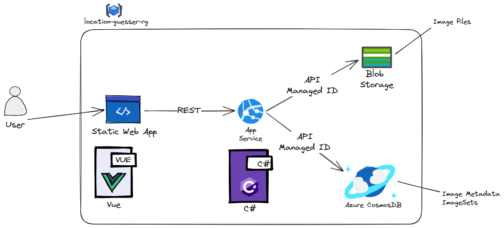

# LocationGuesser

Web-Game inspired by Geoguessr. Try to guess the exact location and year of a given image.

Built with:

- Vue 3 on the frontend
- C# and ASP.Net Core on the backend
- CosmosDB NoSQL for persistence
- Azure Blob Storage to store the images
- Azure App Service to host the REST API
- Azure Static Web App to host the frontend

## Architecture

# Helpful Resources

- Blob Storage: [Managed Identity for Blob Storage](https://learn.microsoft.com/de-de/azure/storage/blobs/storage-quickstart-blobs-dotnet?tabs=net-cli%2Cmanaged-identity%2Croles-azure-cli%2Csign-in-azure-cli%2Cidentity-visual-studio)
- Cosmos DB:
  - [Managed Identity for Cosmos DB](https://learn.microsoft.com/en-us/azure/cosmos-db/managed-identity-based-authentication)
  - [Define Managed Identity on VM](https://learn.microsoft.com/en-us/azure/active-directory/managed-identities-azure-resources/tutorial-vm-managed-identities-cosmos?tabs=azure-cli)
